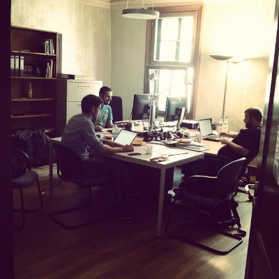
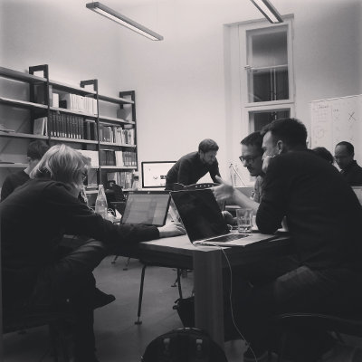
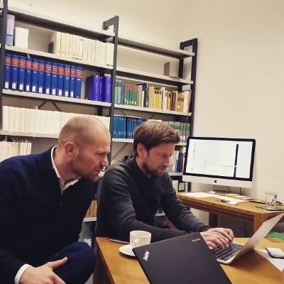
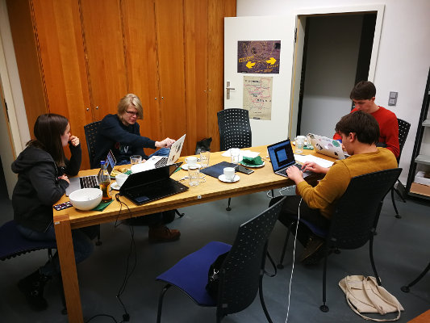
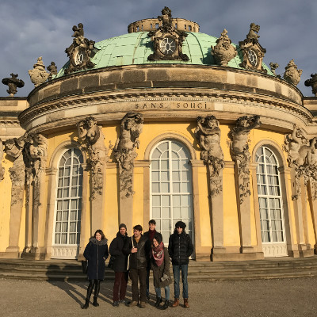
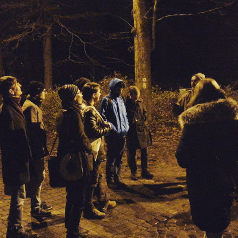
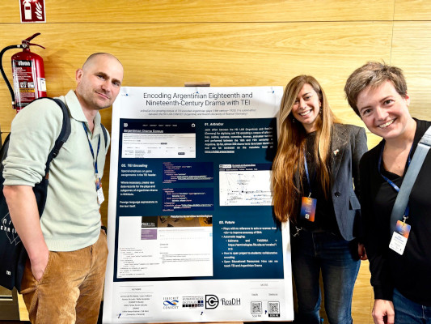

# DraCor Moments

Explore photos of our community actively participating in DraCor events and projects. Unless otherwise noted, all photos are released under the [CC0 licence](https://creativecommons.org/publicdomain/zero/1.0/).

#### Göttingen, 17 June 2015

#### Potsdam, 2–4 December 2017

#### Kraków, 17 September 2025

